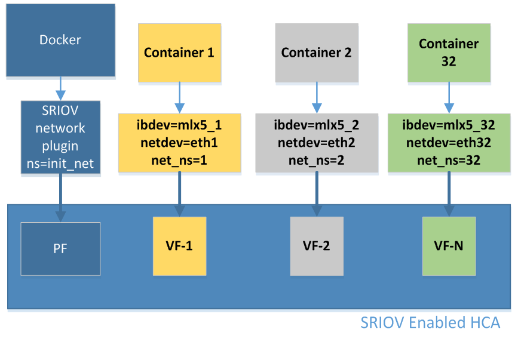

# **Docker SR-IOV的配置**

* [阅读原文](https://support.mellanox.com/s/article/Docker-RDMA-SRIOV-Networking-with-ConnectX4-ConnectX5-ConnectX6)

# 目录

- [**1 概述**](#1-概述)
- [**2 前提条件**](#2-前提条件)
- [**3 配置过程**](#2-前提条件)

## **1 概述**

虚拟RDMA设备（vHCA）提供了对Docker容器的RDMA支持，这些设备使用 Mellanox ConnectX-4 / ConnectX-5 HCA 的 SRIOV 功能实现。

使用 IPoIB 或以太网 SRIOV HCA 提供的虚拟网络设备。虚拟网络设备是使用 SR-IOV VF 创建的。通过使用 SRIOV 网络插件和 Docker 运行时工具 docker_rdma_sriov 使 IPoIB 或以太网网络设备和 vHCA 可供容器使用。



## **2 前提条件**

Mellanox OFED >= 4.4

## **3 配置过程**

* 启用 BIOS 中的 SR-IOV

* 在 HCA 中启用启用 SR-IOV

    - 运行 MFT

        ```bash
        /etc/init.d/opensmd start
        mst start
        ```

    - 定位到 PCI 槽的 HCA 设备

        ```bash
        mst status
        ```

        输出因系统而异，可以找到类似的设备路径 `/dev/mst/mt4115_pciconf0`

    - 查询设备状态

        ```bash
        mlxconfig -d /dev/mst/mt4115_pciconf0 q
        ```

        找到以下输出，说明网卡的 SRIOV 还未启用

        ```bash
        ...
        Device type: ConnectX4
        SRIOV_EN 0
        NUM_OF_VFS 0
        ...
        ```

    - 启用网卡的 SR-IOV，设置 VF 的数量

        ```bash
        mlxconfig -d /dev/mst/mt4115_pciconf0 set SRIOV_EN=1 NUM_OF_VFS=4        
        ```

        > 注意：此时 VF 还无法通过 `lspci` 看见。只有当 MLNX_DRIVER 驱动启用了 SR-IOV 之后才能看见。

    - 重启系统

* 确保 `opensm` 配置为虚拟化模式

    - 打开 `/etc/opensm/opensm.conf`，添加以下内容

        ```bash
        virt_enabled 2
        ```

        > 注意：这仅与 mlx5 驱动程序相关，与 mlx4 （ConnectX-3/Pro） 无关。

        该配置有以下参数值可选：
        |值|含义|备注|
        |-|-|-|
        |0|忽略虚拟化|不支持任务虚拟化（默认值）|
        |1|禁用虚拟化|禁用所有支持虚拟化端口的虚拟化功能|
        |2|启用虚拟化|启用所有支持虚拟化端口的虚拟化功能|

    - 重启 `opensm`

        ```bash
        /etc/init.d/opensmd restart
        ```

* 安装 SR-IOV 插件

    ```bash
    docker pull rdma/sriov-plugin
    ```

* 启动 SR-IOV 网络插件

    ```bash
    docker run \
        -d \
        -v /run/docker/plugins:/run/docker/plugins \
        -v /etc/docker:/etc/docker \
        -v /var/run:/var/run \
        --net=host \
        --privileged \
        rdma/sriov-plugin
    ```

* 创建租户网络

    ```bash
    docker network create -d sriov --subnet=194.168.1.0/24 -o netdevice=ens2f0 mynet
    ```

    这里 `ens2f0` 是一个 PF 网络设备。根据您的系统配置将其更改为正确的名称。该命令为 PF 网络设备 `ens2f0` 启用 SRIOV，并为 InfiniBand 或 RoCE 进行必要的配置，例如 vlan、GUID、mac 地址、特权、信任模式。

* 启动容器

    ```bash
    docker run -it --network=mynet --ip=194.168.1.2 ubuntu:latest /bin/bash
    ```